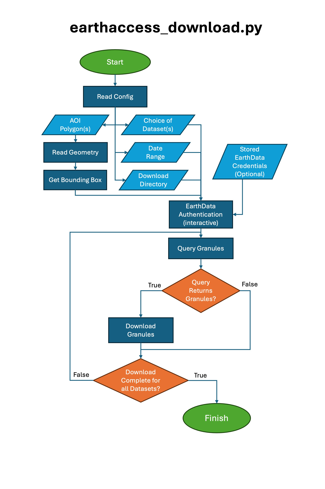
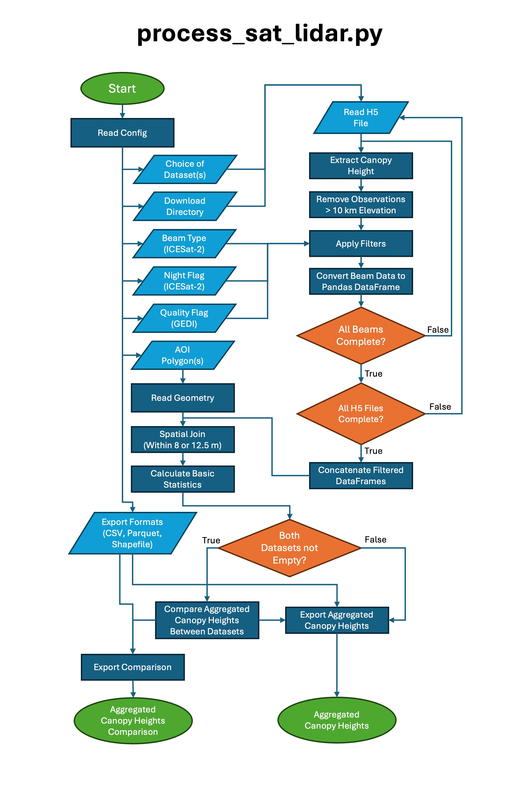
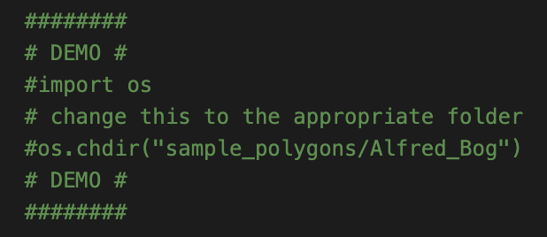
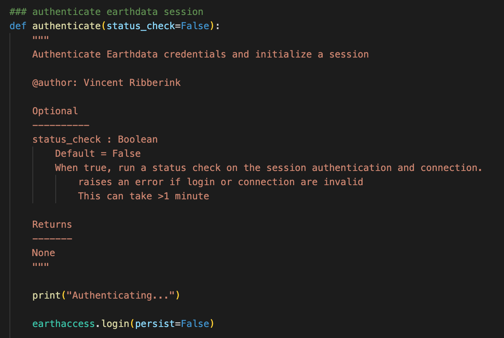

# PeatLidar - About

PeatLidar is a tool used to download and aggregate satellite lidar data to one or more polygons.

This was designed to extract canopy height data from ICESat-2 ATL08 and GEDI L2A products. A comparison is done if data from both products is present in a polygon.

## General Workflow

**earthaccess_download.py** - Download granules (large chunks of data)
1. Get bounding box of input polygons
2. Query granules for given extent & date range
3. Download granules to local directory

**process_sat_lidar.py** - Aggregate by polygon and compare
1. Extract canopy height from downloaded granules
2. Apply various filters (Night Flag, Beam Type) - See config
3. Aggregate by polygon (mean, min, max, stdev)
4. Compare GEDI L2A to ICESat-2 ATL08 values if both are present
5. Export aggregated data and/or comparison as one or more of CSV, 

**user_input3.py** - Optional script for interactively creating the config file

---

Python Dependencies:
- geopandas
- earthaccess
- h5py
- *configparser*
- *pathlib*
- *datetime*
- *OS*

This tool was developed as part of a final project for the Winter 2026 GEOM4009 Custom Geomatics Applications course at Carleton University.

Authors: Vincent Ribberink, Joshua Salvador, Ethan Gauthier

---

# Contents

**docs** - Documentation and related files generated with Sphinx

**scripts** - The three Python scripts comprising the tool

**samples** - Sample polygons, config files, and outputs for two demo folders. See User Guide below for how to run a demo

> /Alfred_Bog - 268 polygons, small area, E Ontario

> /Lake_Claire - 1 polygon, large area, N Alberta

**images** - Image files used throughout the documentation

**peatlidar.yml** - Conda environment file

**LICENSE** - License file

**PeatLidar Presentation.pdf** - Slide deck from project presentation

**PeatLidar Final Report.pdf** - Copy of Final Report. Includes introduction, discussion, and conclusions.

**PeatLidar 1.0.0 Documentation.pdf** Sphinx-generated documentation as a pdf file

---

# Getting Started

## Setup/Installation

### Conda Environment

With a valid Conda install, run the following to create the required Conda environment

`conda env create -f peatlidar.yml`

NASA EarthData account credentials are required for downloading data. An account can be created for free [here](https://urs.earthdata.nasa.gov/users/new)

### Clone Repository Locally

Change the working directory to the desired location for the cloned directory, then run

`git clone https://github.com/GEOM4009/PeatLidar.git`

### Config

Both the download (*earthaccess_download.py*) and aggregation/processing scripts (*process_sat_lidar.py*) use a configuration file to store various parameters. This file can be created manually, copied from the demo examples in */samples*, or created interactively with the optional third script *user_input3.py*. This file must be use INI format.

---

## User Guide

This section will give a brief overview on how to run the *"Alfred_Bog"* demo once the Conda environment is active:

1. Set Working Directory
   
Uncomment the **DEMO** section in both `earthaccess_download.py` and `process_sat_lidar.py` scripts, located at the top of the main() functions. Set the working directory to the appropriate folder in `/samples`. By default, it is set to `Alfred_Bog`.

2. Configuration
   
Set the parameters as desired in the config file (`config_sat_lidar.txt`). Comments explain what each parameter does. This config is used for both scripts.

3. Run **earthaccess_download.py**

If authenticating for the first time, earthaccess will prompt you for your account credentials. See the FAQ section for how to store credentials locally. Authentication may take some time, after which the number of queried granules will be shown, as well as a progress bar for the downloads. These downloads can be significant: the default config for this demo (2-year period) for Alfred Bog is already ~25 GB.
> *Note: the download directory does not exist yet and will have to be created locally. By default, it is named "download_dir" in the config file.*

4. Run **process_sat_lidar.py**

This will aggregate the data to the input polygons, compare results between satellites if possible, and export as the file formats defined in the config. The number of filtered and intersecting observations will be printed, as well as whether the comparison was done or not.

5. Results

The results can now be found in the output directory defined in the config file!

---

## FAQ/Troubleshooting

**Do I have to enter my credentials every time I run earthaccess_download.py()?:** 
>In earthaccess_download.authenticate(), "earthaccess.login("persist=False") can be set to True to store credentials locally in a .netrc file to avoid this.

**EarthData Authentication is taking a long time:** 
>It can take 1-2 minutes depending on connection speed.

**No granules were found by earthaccess_download.py():** 
>Try expanding the date range and/or choose a larger area.

**No intersecting observations were found when aggregating:** 
>See above. Also, some of the filters can remove significant portions of the total data, so also try disabling those. Sometimes there simply aren't any overlapping observations, especially with small polygons. To manually check the data, uncomment the "export for testing" lines near the end of the convert_icesat() and/or convert_gedi() functions. The un-aggregated observations will be exported to CSVs with coordinates.

**sjoin() got an unexpected keyword argument 'distance':** 
>This is a relatively recent addition to sjoin(), try updating GeoPandas. If it still doesn't work, change the predicate to 'intersects' and use a buffer to >simulate the footprints instead.

**There are a bunch of warnings when exporting as a Shapefile:** 
>These are just truncation warnings, meaning some field names are too long for a Shapefile and they will be shortened to 10 characters. This can be avoided >by renaming the columns or exporting to a different format.

